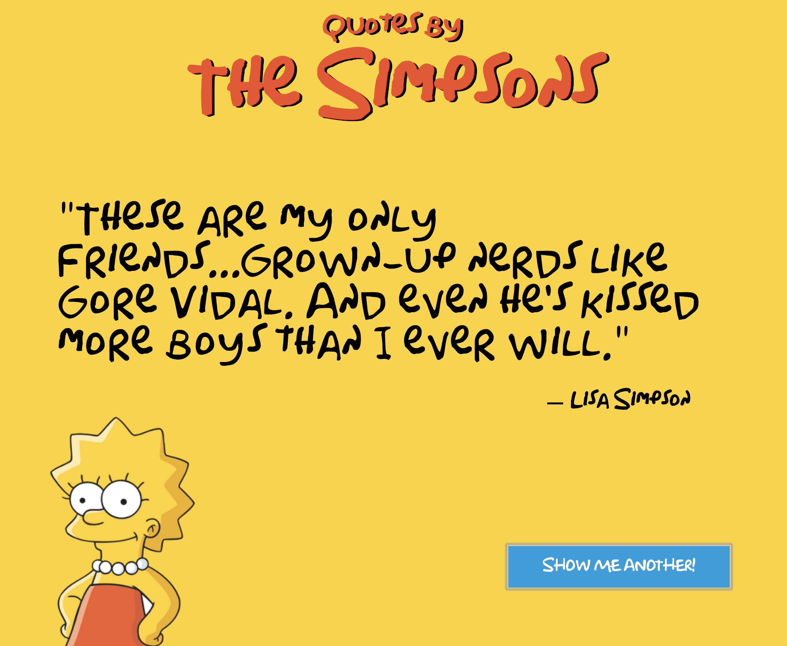

# Simpsons Quote Generator

#### Author: Jarid Warren [ <jaridwarren@gmail.com> ]



## Motivation

I was inspired by @johnstonstu's "Quotes on Don" to create my own quote generator with a deep theme. After finding a [Simpsons quote API](https://thesimpsonsquoteapi.glitch.me/), and [Simpsons font](http://www.dailyfreefonts.com/fonts/info/125-Simpsons.html) I was off to the races!

My intention was to also practice more with Webpack as I've used Gulp in previous projects.

## Technology

* JavaScript ES6 / jQuery
* NPM Webpack
* Sass / CSS
* HTML

## Code Sample

Each time a new quote is requested, a random sound (like Homer's famous 'doh!') is played with the following snippet:

```javascript
const soundClips = ["doh", "excellent", "woohoo", "yes"];
  ajaxCall();
  $(".button").click(() => {
    let soundIndex = Math.floor(Math.random() * 3.99);
    let buttonAudio = new Audio(
      `../../assets/sounds/${soundClips[soundIndex]}.wav`
    );
    buttonAudio.play();
```
